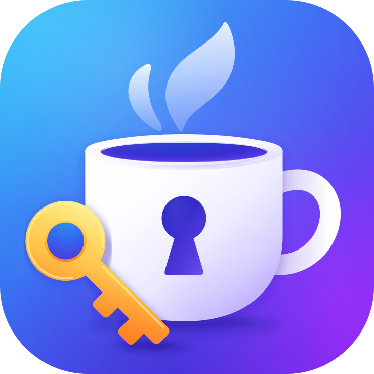

# 🍵 Password Tea — Password Generator and Manager

<table>
  <tr></tr>
  <tr>
    <td colspan="3">README languages:</td>
  </tr>
  <tr></tr>
  <tr>
    <td nowrap width="100">
      <a href="https://github.com/DCFApixels/PasswordTea/blob/main/README-RU.md">
         
        Русский
      </a>  
    </td>
    <td nowrap width="100">
      <a href="https://github.com/DCFApixels/PasswordTea">
         
        English
      </a>  
    </td>
    <!--<td nowrap width="100">
      <a href="https://github.com/DCFApixels/PasswordTea/blob/main/README-ZH.md">
         
        中文
      </a>  
    </td>-->
  </tr>
</table>

Web app: [https://dcfapixels.github.io/PasswordTea/](https://dcfapixels.github.io/PasswordTea/)  
Versioning scheme: [Open](https://gist.github.com/DCFApixels/c3b178a308b411f530361d1d56f1f929#file-dcfapixels_versioning_en-md)

 

A small password manager that derives passwords instead of storing them on the user's device or on a server. It runs on any device with a compatible browser, and a saved copy of Password Tea can also be used without an internet connection.

## 📖 Table of Contents
- [Usage and installation](#-usage-and-installation)
- [How does it work?](#-how-does-it-work)
- [Security](#-security)
- [Features](#-features)
- [Guide](#-guide)
    - [Master Password Input](#master-password-input-screen)
    - [Password Selection](#password-selection-screen)
    - [Password Information Editing](#password-information-editing-screen)
    - [Character Set Editing](#character-set-editing-screen)
- [License](#-license)

 

## 📲 Usage and installation

Password Tea can be used in three ways.

### Use the web version

Open the [Password Tea web app](https://dcfapixels.github.io/PasswordTea/) in a browser. No installation is required. The application's settings are stored in the current browser profile for this web address.

### Install as a PWA

Password Tea is a Progressive Web App (PWA) and can be installed from the web version on supported devices:

+ **Android:** open the web app in a compatible browser and select `Install app` or `Add to Home screen` from the browser menu;
+ **Desktop:** click the install icon in the browser's address bar or select `Install Password Tea` from its menu. Depending on the browser and operating system, a desktop shortcut can also be created.

The installed PWA opens in a separate window and appears in the device's application list. After the first complete online launch, the application files are cached and Password Tea can be started without an internet connection. The exact menu names and installation options depend on the browser and operating system.

### Run locally from source

This option keeps the application files on your device and does not require an internet connection after they have been downloaded:

1. Download the [source code archive](https://github.com/DCFApixels/PasswordTea/archive/refs/heads/main.zip) and extract it, or clone the repository with `git clone https://github.com/DCFApixels/PasswordTea.git`.
2. Open `index.html` in a browser.

This is the simplest fully local option and works without a server. The browser opens the application through a `file://` address. PWA installation and automatic application updates are not available in this mode.

If a browser restricts storage or other APIs for local files, run Password Tea through a dedicated local web server instead. For example, run `python -m http.server 8765` in the project directory and open `http://127.0.0.1:8765/`. Any static local web server can be used instead of Python.

 

## ❓ How does it work?

In short, Password Tea derives passwords instead of storing them. A unique password for each site is generated from the master password and the site's name. The same inputs always produce the same result, so generated passwords do not need to be saved. The master password is strengthened with PBKDF2-HMAC-SHA-256 (600,000 iterations), while SHA3-512 hashes the generation settings before the app's deterministic algorithm maps the result to the configured character sets. The generated password cannot be directly converted back into the master password, although a weak master password may still be guessed by brute force.

> **Compatibility:** introducing PBKDF2 changes every generated password compared with earlier versions. Password Tea does not migrate old generation results.

 

## 🔒 Security

**The following properties help ensure that the application neither stores passwords nor transmits them to third parties:** 
+ The app can function without an internet connection;
+ It does not use third-party frameworks; the [js-sha3](https://github.com/emn178/js-sha3) and [@noble/hashes](https://github.com/paulmillr/noble-hashes) cryptographic libraries are bundled with the source code;
+ It is an open-source project, so users can review the source code and independently verify its behavior.

**Advantages:** 
+ You only need to remember one master password, while a unique password is generated for each site;
+ Generated passwords are deterministic but look random, making them difficult to guess;
+ Password Tea does not store generated passwords, so there is no central password vault whose compromise would expose them all at once;
+ Generated passwords can be changed quickly: changing even one input character produces a new password.

**Disadvantages:** 
+ If the master password is leaked, all generated passwords become accessible;
+ A single master password is easier to target with various types of attacks.

**Local data:** 
Password Tea stores only generation settings in `localStorage`: resource names, user names, versions, and character sets. Neither the master password nor generated passwords are written there. As with any web application, this storage is accessible to code running on the same web origin. Therefore, when using the hosted version, another application on the same origin could theoretically read these settings, but not the passwords themselves.

To eliminate this specific risk completely, [run Password Tea locally from source](#run-locally-from-source) through a dedicated local web server that is not shared with other applications. This gives Password Tea isolated local storage. It does not replace protecting the browser and device from malicious software or extensions.

 

## ⭐ Features

+ **Cross-platform:**

The use of web technologies allows the application to run on any device with a compatible browser. It can also be embedded in other applications.

+ **Customizable character set:**

Some websites require or forbid specific characters. Fine-tuning the character sets allows Password Tea to generate passwords that meet these requirements. Passwords can use Latin letters, digits, and special characters, as well as letters from other alphabets. By default, the app provides sets of special characters, digits, Latin letters, and Cyrillic letters.

+ **Password generation using versioning:**

If a password needs to be changed, its version can be increased in the settings to generate a new one.

+ **Deterministic calculations:**

The same inputs produce the same password on every supported device.

 

## 📜 Guide

### Master Password Input Screen
On the initial screen, the user is prompted to enter the master password, which is used to generate passwords.

After entering the master password, press the "Continue" button to proceed to the password list.

### Password Selection Screen

At the top of the screen, a list of resources is displayed. To retrieve a password, select the desired resource from the list.

The resource list can be edited. The plus button at the bottom adds a new entry, the gear button opens the resource editing screen, and the adjacent trash button removes the resource from the list.

After selecting a resource, its generated password appears in the "password" field at the bottom. The button to the right copies the password to the clipboard, while the next button reveals the password, which is hidden by default.

At the bottom of the screen, there are buttons for importing and exporting user data. These functions allow data to be transferred between devices.

### Password Information Editing Screen

At the top, four fields are available for editing:
+ **Name** - the name of the resource for which the password is generated; this name is also displayed on the password selection screen.
+ **User** - an account identifier used to generate different passwords for multiple accounts on the same resource.
+ **Length** - the length of the password.
+ **Version** - the password version. Clicking the `Up` button increases the version and generates a new password.

Below is a list of character sets from which the user can select the ones to be used in password generation.

The character set list can be edited. The plus button at the bottom adds a new empty set, the gear button opens the character set editing screen, and the adjacent trash button removes the set from the list.

After completing the edits, click `Save` to save the changes or `Cancel` to discard them.

### Character Set Editing Screen

Three fields are available for editing:
+ **Name** - the name of the set displayed in the application. This does not affect password generation.
+ **Charset** - the set of characters as text. After saving, the characters are sorted and duplicates are removed.
+ **Priority** - the priority of the set. It affects how frequently characters from the set appear in the password relative to the priorities of all selected sets. The higher the priority, the more frequently its characters appear. Regardless of priority, the password contains at least one character from each selected set.

After completing the edits, click `Save` to save the changes or `Cancel` to discard them.

 

## 📑 License

The MIT License: [https://raw.githubusercontent.com/DCFApixels/PasswordTea/refs/heads/main/LICENSE](https://raw.githubusercontent.com/DCFApixels/PasswordTea/refs/heads/main/LICENSE)

 
 
